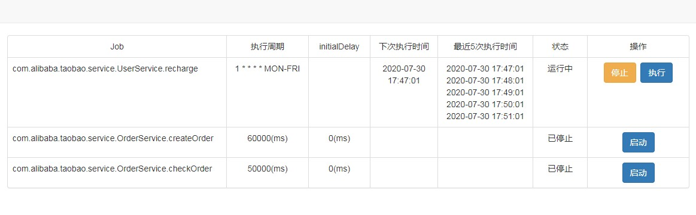

## Spring Schedule Admin
Spring Schedule Admin简单、易用、轻量级的Spring定时任务web管理工具。无需修改代码，一个注解即可提供对定时任务的查看、启动、暂停、运行等功能。

## 实现原理
- 实现org.springframework.scheduling.annotation.SchedulingConfigurer接口，拿到ScheduledTaskRegistrar对象的实例。
- 从ScheduledTaskRegistrar实例中获取所有已经解析好的@Scheduled定时任务。
- 使用自定义的org.springframework.scheduling.TaskScheduler对所有定时任务进行接管，获取到所有任务执行结果的引用。
- 拿到定时任务的引用、执行结果的引用即可对定时任务进行执行、停止、启动等操作

## Requirements:
* Java 8 or Above
* Apache Maven 3.x

## Maven dependency
* Spring 4.x

## 如何使用
直接在启动类上加上 @EnableScheduleAdmin
```java
@EnableScheduleAdmin
@EnableScheduling
@SpringBootApplication
public class OrderApplication {
    public static void main(String[] args) {
        SpringApplication.run(OrderApplication.class, args);
    }
}
```

## Job管理页面
启动应用，在浏览器中访问 /schedule/dashboard.html


## 参数说明
- schedule.admin.enabled  是否启用Job管理功能，默认true

## 后期规划
- 管理页面增加权限控制

## 打包
mvn clean package